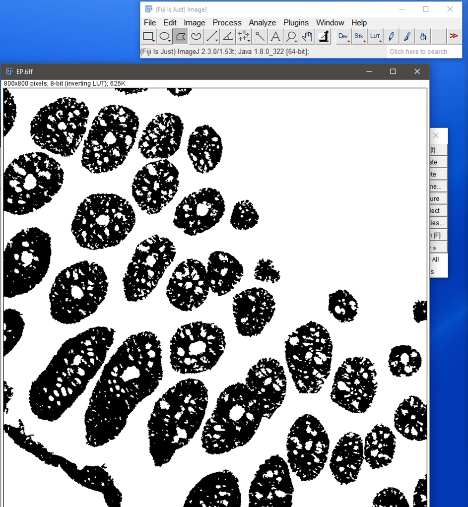

# Generating Compartment and Structural Masks

## Generating Epithelial Masks

For **epithelial segmentation**, open the ImageJ script `4 ExtractEpiMask.ijm` and **change all required variables** there before running it:

```{java eval=FALSE}
// Set your 'analysis' folder directory
dir = "IMC/analysis";
// Specify the channel number in the full image stack that contains your epithelial stain (eg. E-cadherin)
channelNo = 7;
```

**Note:** there are also some *optional* variables you can change too if you wish:

```{java eval=FALSE}
// Apply threshold. Takes either an integer number up to 65535 or a preset algorithm like "Triangle".
thresh = "Triangle";
// After segmenting will remove epithelium below this pixel area size. Increase to remove more scraps.
epiSize = 150;
// Gaussian blur. Increase if too many grainy dots in final mask or want mask to look smoother.
blurr = 0.75;
// Erode x2 then dilate x2 to get rid of small attachments to larger epithelium. Increase if too many scraps emanating from epithelium you need to trim off. 
erodeNum = 2;
dilateNum = 2;
// Built-in delay so user can check if happy with result. Also prints number of current image for user to note down if any issues with image. 
// 1000 is 1 second. The image name then pops up for delayTime + 2 seconds to give you time to write down the image name.  
delayTime = 1000;
```

This script generates masks for epithelial areas in an image stack by:

1. **Extracting** a user-specified channel
2. **Normalising** it
3. **Applying** a user-defined threshold
4. **Filtering out** small particles
5. **Eroding** the mask to remove residual attachments to the epithelium
6. **Dilating** the mask

A delay is built into the macro to allow the user to visually check the results during processing and note down names of any 'trouble images' which require correction. All masks are saved to the existing `analysis/3b_for_cellprofiler` folder, with the suffix `_full_EP` at the end of the filename. 

To correct any 'trouble images', follow the steps below:

1. Open them and run **Invert LUT** from the task bar
2. Use one of the selection tools to outline areas for removal
3. Press the `Backspace` key to delete these areas, which will then become black (assigned a value of `0`)
4. Run **Invert LUT** again so the epithelium is black and the background is white (as shown below)
5. Save the image under the same filename it was originally saved to

```{r, echo=FALSE, fig.align='center'}

```