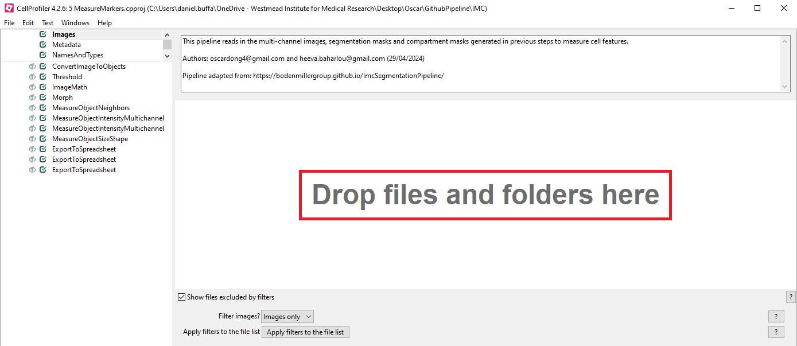
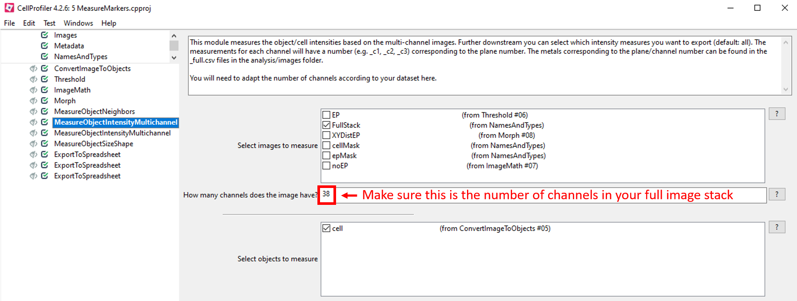
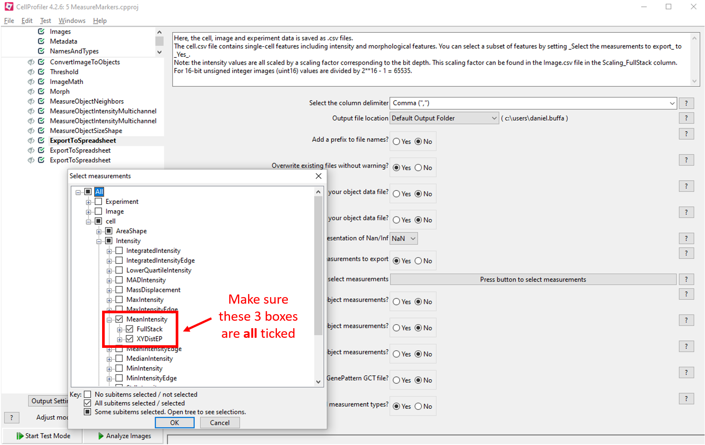

# Processing Data in CellProfiler

## Installing CellProfiler

**CellProfiler** is a tool we will use to calculate marker intensities and other metrics for each segmented cell. Install it from [here](https://cellprofiler.org/).

As part of the pipeline, we will be using some custom plugins for CellProfiler. Configure CellProfiler to use the plugins by following the steps below:

1. Open the CellProfiler GUI
2. Select **File** &rarr; **Preferences...**
3. Scroll down and set **CellProfiler plugins directory** to `path/to/ImcSegmentationPipeline/resources/ImcPluginsCP/plugins`
4. **Restart CellProfiler**

## Using CellProfiler

To use CellProfiler, open `5 MeasureMarkers.cpproj` and follow the steps below:

1. Drag and drop the `analysis/3b_for_cellprofiler` folder into the CellProfiler `Images` window:

```{r, echo=FALSE, fig.align='center'}

```

2. Select **File** &rarr; **Preferences...** 
3. Set **Default Output Folder** to `analysis/5_cellprofiler_output` and click `Save`
4. Click the **first** `MeasureMarkerIntensityMultichannel` module on the left hand side of the screen (the `FullStack` box in **Select images to measure** should be ticked), and set the number of channels in your full image stack:

```{r, echo=FALSE, fig.align='center'}

```

5. Click the **first** `ExportToSpreadsheet` module on the left hand side of the screen, press the `Press button to select measurements` button, click **cell** &rarr; **Intensity** &rarr; **MeanIntensity** to open a series of drop-down menus, make sure the **3 boxes** below are **ALL** ticked, and click `OK`:

```{r, echo=FALSE, fig.align='center'}

```

6. Click the `Analyze Images` button at the bottom of the screen and wait for CellProfiler to finish running

After CellProfiler has finished running, the following files will have been generated in the `analysis/5_cellprofiler_output` folder:
- `cell.csv`: contains features (columns) for each cell (rows)
- `Experiment.csv`: contains metadata related to the CellProfiler version used
- `Image.csv`: contains image-level measurements (eg. channel intensities) and acquisition metadata
- `Object relationships.csv`: contains neighbour information in form of an edge list between cells

Now, you are ready to proceed to the **`R`** part of the pipeline.